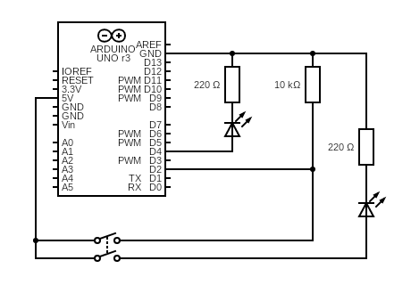

# Button press
Sketch that lights an LED when a button is pressed.  
Pin D2 is used as digital input, detecting when the button is pressed.  
Pin D4 is used as output, mirroring the state of pin D2 and lighting the LED when the button is pressed. 

## Diagram
The button is connected both to a pull-down resistor to enable the input reading from pin D2, and to a control circuit that is directly closed by the press of the button and lights an LED. 
