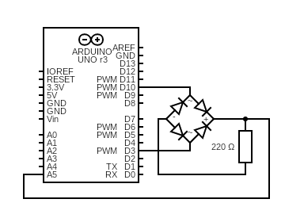

# Diode Bridge  
The sketch produces an AC signal as input for a diode bridge, and reads the output DC voltage.

## Diagram  
Pin D10 produces the high level of the AC signal, using pin D3 as its ground level. The pin A5 reads the voltage level of the output DC signal.  
