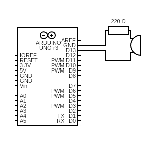

# Morse code
This sketch transforms a given string into its morse code representation in the form of digital pulses on pin D13.

# Diagram
Pin D13 is connected to an active buzzer that produces the morse code representation of the starting string.   
  

# Library morse_instance
The folder "src/morse_instance" contains the .h and .cpp files with the definition of the class Morse_instance.  
Morse_instance's constructor receives the output pin on which producing the morse code, and the unit delay in milliseconds to use to reprodice the code (dot is 1 unit, dash is 3 units).