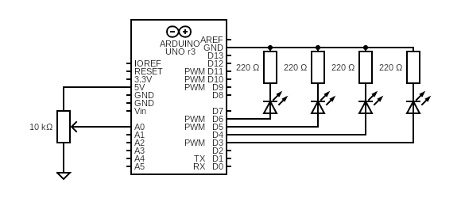

# Potentiometer Output
A potentiometer is read as input from pin A0.  
Its value, normalized from 0 to 100, is used to light four LEDs using pins D3 to D6 as output:  
- D6 on: normalized input >= 25
- D5 on: normalized input >= 50
- D4 on: normalized input >= 75
- D3 on: normalized input >= 100

## Diagram
