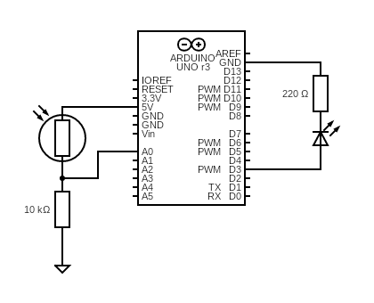
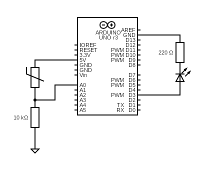

# Resistive Sensors
The sketch is shared by two similar circuits that use a photoresistor and a thermistor respectively. Voltage at the end of the sensor is read as input, and is ther returned as output to light an LED with variable intensity.

# Diagram
Both circuits use A0 to read the input voltage from the sensor, connected to a pulldown resistor.
  
  
*Photoresistor*  

  
*Thermistor*