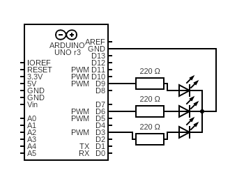

# RGB LED
The sketch lights the RGB LED (common cathode), cycling through different hues.

## Diagram
Each color pin of the RGB LED is connected to a security resistor.  
Pin D9 is connected to the red pin.  
Pin D6 is connected to the green pin.  
Pin D3 is connected to the blue pin.  
